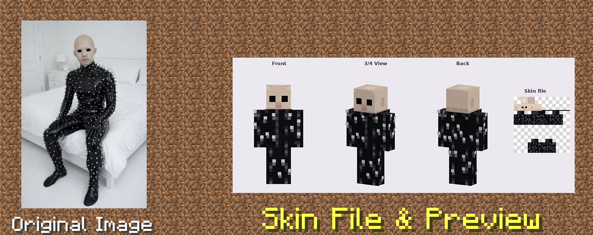

# 🧱 Minecraft Skin Maker

**Turn a photo or a description into a Minecraft skin, then see it on the 3D model before you upload it.**

Minecraft Skin Maker is a skill for [Claude](https://claude.ai). Give Claude a selfie, a picture of your character, or a few sentences like "a sleepy wizard with a green hoodie." It makes a skin file you can use in the game, plus preview images showing the character from the front, at an angle, and from behind.



---

## ✨ What it does

- **Works from photos or words.** It picks out hair style and colour, skin tone, eye colour, expression, clothes, patterns and accessories.
- **Captures the details that make a character recognisable.** A favourite necklace, dyed hair ends or a floral print all get their own pixels.
- **Shows a 3D preview.** You see the front, a 3/4 angle and the back on the real player model, not just the flat texture.
- **Checks its own work.** Claude looks over the preview and fixes problems like holes, stray pixels or a face that doesn't look right before showing it to you.
- **Produces a file the game accepts.** You get a standard 64×64 PNG with the base and outer layers set up correctly.
- **Supports both arm models.** Slim (Alex-style, 3px) and Classic (Steve-style, 4px). Claude tells you which one to select when you upload.
- **Makes it easy to change things.** Ask for a different outfit, hair colour or expression and it re-renders.

---

## 🚀 Installation

### Claude.ai (web, desktop, mobile)

1. Download `minecraft-skin-maker.skill` from the [Releases](../../releases) page, or zip the `minecraft-skin-maker/` folder yourself.
2. In Claude, open **Settings → Capabilities → Skills** and upload the file.
3. Make sure **Code execution and file creation** is turned on. The skill runs Python to draw and render the skin.

### Claude Code

Copy the folder into your skills directory:

```bash
# for all your projects
cp -r minecraft-skin-maker ~/.claude/skills/

# or just for one project
cp -r minecraft-skin-maker .claude/skills/
```

---

## 🎮 How to use it

Just ask. You don't have to mention the skill; Claude uses it on its own when you ask for a skin.

> 📸 *"Make me a Minecraft skin from this photo."* (attach a picture)

> ✍️ *"Create a skin of a pirate captain with a long navy coat, a gold earring and messy red hair."*

> 🎨 *"Take the skin you just made and swap the dress for ripped jeans and sneakers."*

You'll get back two files:

| File | What it's for |
|---|---|
| `yourname_preview.png` | The 3D preview. Check this first. |
| `yourname_skin.png` | The skin itself. This is the file you upload. |

**About photos:** a photo usually shows only part of a person. Anything that isn't visible, often the legs and shoes, gets made up to match the rest of the outfit. Claude tells you what it invented so you can change it.

---

## 📥 Putting the skin in Minecraft

**Java Edition**

1. Open the Minecraft Launcher and go to **Skins**.
2. Click **New skin** and upload `yourname_skin.png`.
3. Choose the arm model Claude recommended (**Slim** or **Classic**).
4. Save and use it.

**Bedrock Edition**

1. From the main menu, open **Dressing Room**.
2. Go to **Classic Skins → Owned → Import** and choose the PNG.
3. Pick the arm model Claude recommended.

> 💡 If there's a dark stripe or gap on your character's arms in the game, the arm model is set wrong. Switch between Slim and Classic.

---

## 🗂️ What's inside

```
minecraft-skin-maker/
├── SKILL.md                  # Instructions Claude follows (the workflow)
├── scripts/
│   ├── skin_lib.py           # Drawing helpers for painting skins
│   ├── example_design.py     # A complete example skin to copy from
│   └── render_preview.py     # The 3D preview renderer
└── references/
    └── layout.md             # Cheat sheet for the skin texture layout
```

---

## 🛠️ Using the scripts yourself (optional)

You can also run the scripts directly with Python 3 and [Pillow](https://pypi.org/project/pillow/), without Claude.

```bash
pip install pillow

# Build the example skin
python scripts/example_design.py my_skin.png

# Render a 3D preview of any 64x64 skin (slim arms by default)
python scripts/render_preview.py my_skin.png preview.png

# For Steve-style (classic) arms
python scripts/render_preview.py my_skin.png preview.png --classic
```

`render_preview.py` works with **any** 64×64 skin, including ones you downloaded or drew yourself.

To design your own skin, copy `example_design.py` and edit it. The face is drawn as a small text grid, so changing the expression looks like this:

```python
s.paint_grid(head["front"], [
    "HHHHHHHH",
    "HHHddHHH",
    "HhSSSShH",
    "HSBSSBSH",   # B = eyebrows
    "HWESSEWH",   # W = eye white, E = iris
    "HPSSSSPH",   # P = blush
    "HSMTTMSH",   # M = lips, T = teeth → a big smile
    "HsssssSH",
], colours)
```

Each letter is one pixel. `references/layout.md` explains which part of the texture maps to which part of the body.

---

## ❓ FAQ

**Can it make a skin of a famous game or cartoon character?**
No. The skill makes original designs and likenesses of you or people you describe. It won't recreate trademarked or copyrighted characters. It can make an original character in a similar spirit.

**Why is my preview slightly different from how it looks in the game?**
The preview uses simple lighting, and Minecraft's shading and camera are a bit different. The pixels are the same, though.

**Can I edit a skin I already have?**
Yes. Upload the PNG and ask for a change, like "make the hoodie purple" or "add glasses."

**Does it support the old 64×32 format?**
It always makes 64×64 skins. That format has overlays for every body part and works in all current versions of Minecraft.

---

## 🤝 Contributing

Ideas and pull requests are welcome, for example:

- more example designs (armour, hoodies, animal ears)
- more fabric pattern presets
- animated or posed previews

Please open an issue before starting a large change.

---

## 📄 License

MIT. Make whatever you like with it.

*Minecraft is a trademark of Mojang Studios. This project is not affiliated with or endorsed by Mojang or Microsoft.*
